# Buts
Avec cette procédure, nous mettons en place notre pare-feu logiciel (*software firewall*). Nous voulons ainsi avoir un environnement identique à celui d'une petite ou moyenne entreprise.

Dans le cadre de ce laboratoire, ceci nous est utile pour :

1. Cloisonner l'environnement de test du reste du réseau ETML
2. Permettre à l'environnement de test d'avoir ses propres services (DNS, DHCP, ...)

| 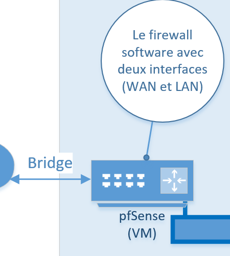 |
|:--:|
| <b>Figure 1 : Mise en place de pfSense</b>|

Ce composant a deux interfaces réseau :

1. LAN (réseau interne dans la configuration VirtualBox)
2. WAN (accès par pont dans la configuration VirtualBox)

Cette VM (*Virtual Machine*) servira de passerelle (*gateway*) pour les autres VM du réseau. Lorsque cette VM est éteinte, Internet n'est plus disponible pour les machines du réseau interne.

# Procédure

## Téléchargement
1. Télecharger l'ISO à l'adresse suivante https://www.pfsense.org/download/

|  |
|:--:|
| <b>Figure 2 : Téléchargement de l'ISO pfSense</b>|

2. L'archive est au format .gz, il convient d'en extraire le fichier ISO avec 7-Zip.

## Création de la machine virtuelle

Commençons donc par créer une nouvelle VM. Les écrans suivants décrivent pas à pas les paramètres à utiliser.

1. Paramètres importants :
  * Type : **BSD**
  * Version : **FreeBSD (64-bit)**
  
|  |
|:--:|
| <b>Figure 3 : Choix de l'OS</b>|

2. Taille de la mémoire

|  |
|:--:|
| <b>Figure 4 : Taille de la mémoire</b>|

> Ici 1024MB est une taille suffisante, il est toujours possible de l'augmenter si la VM était trop lente.

3. Disque dur

|  |
|:--:|
| <b>Figure 5 : Créer un disque dur virtuel maintenant</b>|

4. Type de fichier de disque dur

|  |
|:--:|
| <b>Figure 6 : Créer un disque dur virtuel maintenant</b>|

5. Stockage sur disque dur physique

|  |
|:--:|
| <b>Figure 7 : Créer un disque dur virtuel maintenant</b>|

6. Emplacement du fichier et taille

Nous arrivons maintenant à la dernière étape et il ne reste plus qu'à indiquer où stocker le dique dur virtuel.

|  |
|:--:|
| <b>Figure 8 : Emplacement du fichier et taille</b>|

> Ici 16GB semble être exagéré. Nous recommandons plutôt de réduire la taille du disque à 8 GB.

7. Ne démarrez pas tout de suite la VM.

## Ajout d'un disque optique

1. Ouvrez la configuration de votre VM *pfSense*

| 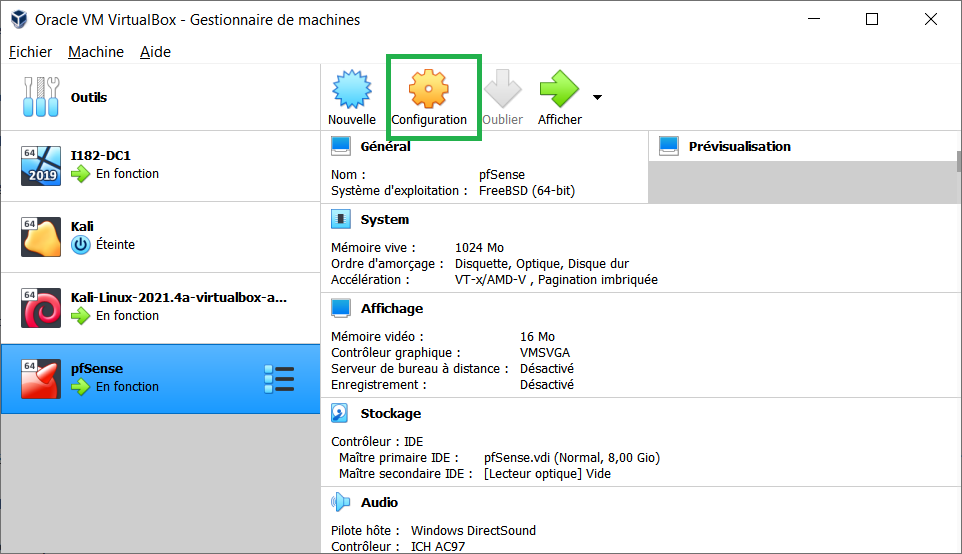 |
|:--:|
| <b>Figure 9 : Configuration de la VM pfSense</b>|

2. Stockage 

| 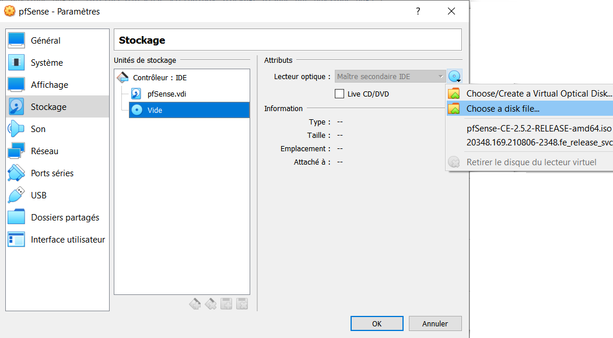 |
|:--:|
| <b>Figure 10 : Ajout d'un disque optique</b>|

3. Choix du fichier ISO

|  |
|:--:|
| <b>Figure 10 : Ajout d'un disque optique</b>|

## Ajout des deux interfaces réseau

## Ajout des deux interfaces réseau

## Démarrage de la VM pfSense et installation

## Désactivation du DHCP

|  |
|:--:|
| <b>Figure 11 : pfSense menu</b>|

|  |
|:--:|
| <b>Figure 12 : pfSense menu</b>|

| 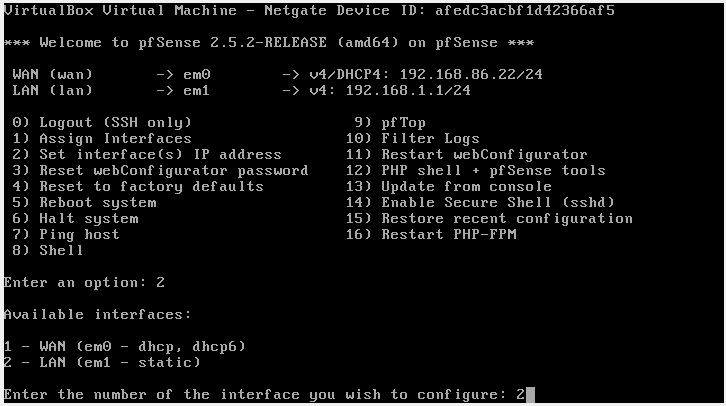 |
|:--:|
| <b>Figure 13 : pfSense menu</b>|

| 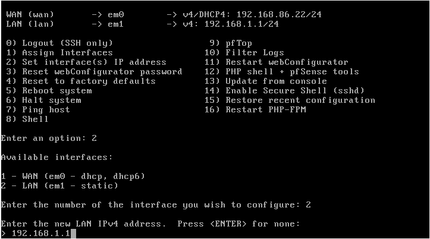 |
|:--:|
| <b>Figure 14 : pfSense menu</b>|

| 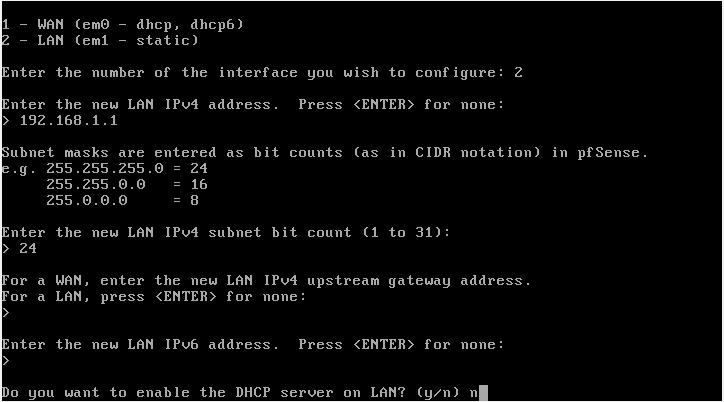 |
|:--:|
| <b>Figure 15 : pfSense menu</b>|

| 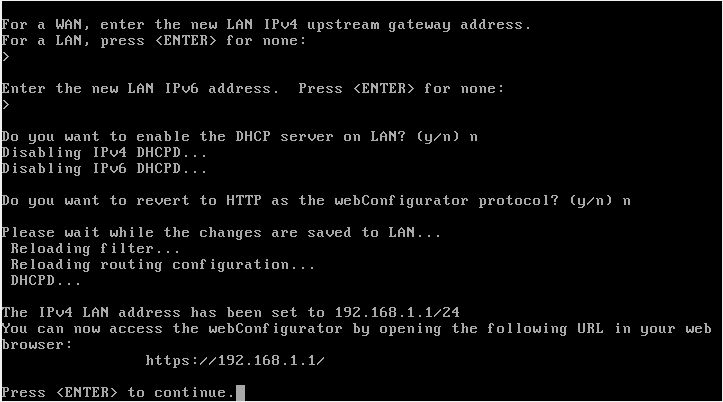 |
|:--:|
| <b>Figure 16 : pfSense menu</b>|

| 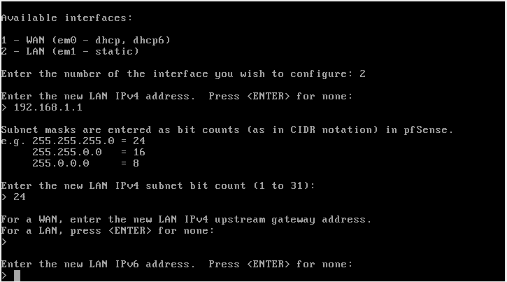 |
|:--:|
| <b>Figure 17 : pfSense menu</b>|

| 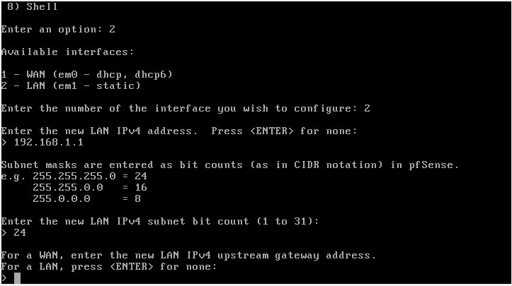 |
|:--:|
| <b>Figure 18 : pfSense menu</b>|

| 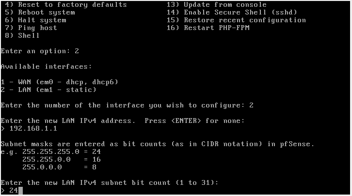 |
|:--:|
| <b>Figure 19 : pfSense menu</b>|

| 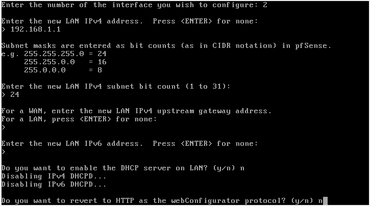 |
|:--:|
| <b>Figure 20 : pfSense menu</b>|

