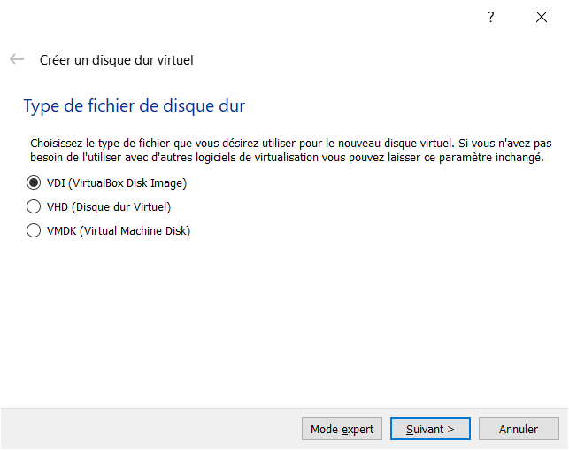

# Buts
En installant pfSense dans une machine virtuelle, nous souhaitons cloisonner notre réseau et nos machines virtuelles.

# Procédure

## Téléchargement
1. Télecharger l'ISO à l'adresse suivante https://www.pfsense.org/download/

## Création de la machine virtuelle

1. Paramètres importants :

  Type : **BSD** et Version : **FreeBSD (64-bit)**
  

## Installation et configurtion de pfSense

